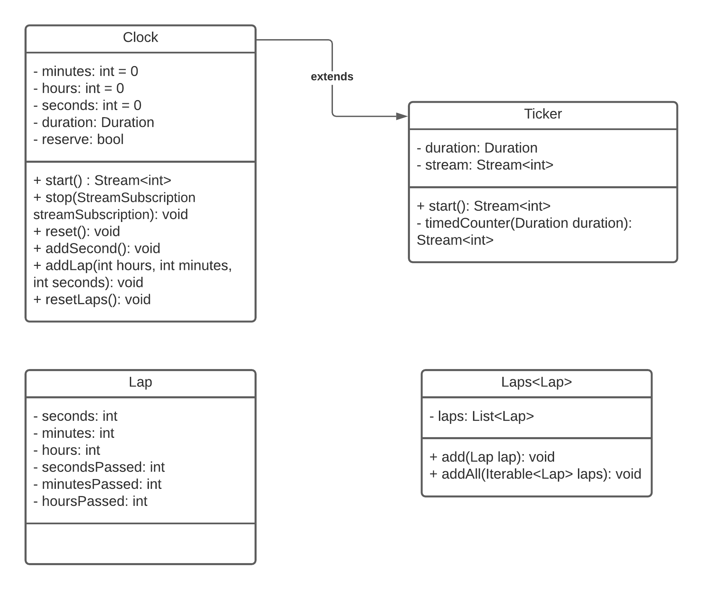

# Cronometro & Timer
Questo esercizio verte sulla realizzazione di un Timer e un Cronometro mediante l'utilizzo di uno Stream per la gestione dei Tick (segnali di tempo prestabiliti) in Flutter (Dart). Come richiesto dalla consegna dell'esercizio sono state realizzare diverse features sia grafiche che tecniche, come per esempio i Lap, ovvero i tempi parziali (per il StopWatch) che l'utente può tracciare, oppure la selezione del tempo per il Timer mediante dei bottoni (`+` e `-`).

## Struttura del progetto
```
+---ios
|
+---android
|
+---build
|
+---ios
|
+---lib                     //Cartella principale del progetto
|   |   main.dart           //File principale, eseguibile.
|   |
|   +---utils               //Utilità e classi
|   |       clock.dart      //Classe per la gestione dell'orologio (estende ticker)
|   |       laps.dart       //Classe per la gestione dei giri (laps)
|   |       ticker.dart     //Classe per la gestione dei tick
|   |
|   \---views               //Visualizzazioni della pagina
|           stopwatch.dart  //Visualizzazione della sezione stopwatch
|           timer.dart      //Visualizzazione della sezione timer
|
\---test                    //Cartella di test
        widget_test.dart
```

Come illustrato nel diagramma ad albero qui sopra mostrato, il progetto, contenuto nalla cartella principale (`lib`), è stato suddiviso nei seguenti **files**:
- `main` → File contenente la Classe principale del progetto.
- `clock` → File contenente la Classe che gestisce le ore, i secondi, i minuti e le funzioni per avviare, stoppare e resettare l'orario. Tale classe estende la classe `Ticker`. 
- `laps` → File suddiviso nelle seguenti classi:
  - `Laps` → Struttura dati che estende `ListBase` per la realizzazione di una lista di `Lap` (`Laps<Lap>`).
  - `Lap` → Struttura dati (Classe) per il salvataggio dei dati relativi ad un Lap (giro del cronometro).
- `ticker` → Classe che gestisce i Tick dato un tempo prestabilito (`Duration`), esempio: 1 secondo. Tale classe viene estesa da `Clock` in quanto utilizzata per gestire il tempo come se fosse un metronomo.
- `stopwatch` → Widget della pagina dedicata allo `StopWatch`.
- `timer` → Wiget della pagina dedicata al `Timer`.

## Struttura delle classi
Qui di seguito è riportato il diagramma UML delle classi presenti nella cartella `utils`, classi utilizzate per la realizzazione di strutture dati personalizzate.



**NB:** Per semplicità non sono stati riportati, nel diagramma UML mostrato, i motodi `getter` e `setter`

### Clock
##### Attributi:
- `reverse` → Attributo utilizzato per deterrminare se la Classe `Clock` viene utilizzata dal Timer o dallo StopWatch.
##### Metodi:
- **start():** `Stream<int>` → Metodo utilizzata per avviare il Clock. Il tipo di rotorno è uno `Stream<int>` fornendo un metodo asincrono per inviare dati in modo continuo e, nel caso del Clock, in modo costante.
- **stop(StreamSubscription streamSubscription):** `void` → Metodo, che dato uno `StreamSubscription`, il ritorno del metodo `listen()` di uno Stream, stoppa il conteggio del tempo.
- **reset():** `void` → Reset del tempo (porta a `0` i secondi, i minuti e le ore).
- **addSecond() :** `void` → In base a `reservation` questo metodo sottrae un secondo all'orario scelto (Timer) o ne aggiunge uno (StopWatch).
- **addLap(int hours, int minutes, int seconds):** `void` → Aggiunge un giro alla lista `Laps<Lap>`.
- **resetLaps():** `void` → Metodo utilizzato per resettare tutti i `Lap` presenti nella lista `Laps<lap>`.

### Ticker
##### Metodi:
- **start():** `Stream<int>` → Inizializza lo `Stream` mediante il metodo `timedCounter`.
- **timedCounter(Duration duration):** `Stream<int>` → Funzione privata della Classe `Ticker` che realizza gli impulsi in base all'intervallo passato come parametro. 
``` dart
  Stream<int> timedCounter(Duration interval) async* {
    int i = 0;
    while (true) {
      await Future.delayed(interval); //metodo per bloccare l'esecuzione del programma per interval tempo.
      yield i++;
    }
  }
```

### Struttuda dei Widget (views)
#### Timer
```

```
#### StopWatch
```
+--- Scaffold
|     \-- Center
|         +-- Column
|              +-- Container
|              |     \-- Text //Orario {hh:mm:ss}
|              +-- Visibility
|              |    \-- Container
|              |        \-- ListView.separated //Widget per la grafica dei Laps
|              |             \-- Container
|              |                  \-- Container
|              |                      \-- Row
|              |                          \-- Column
|              |                              +-- Text //Identificativo del lap
|              |                              +-- Container
|              |                              |    \-- Text //hh:mm:ss trascorsi
|              |                              \-- Text //Orario del Lap
|              \-- Container
|                   \-- ButtonBar //Contenitore dei bottoni
|                       +-- Visibility
|                       |    +-- RaisedButton //Bottono per i Lap
|                       +-- RaisedButton //Bottone "start" e "stop"
|                       \-- Visibility
|                           \-- RaisedButton //Bottone per il reset
```