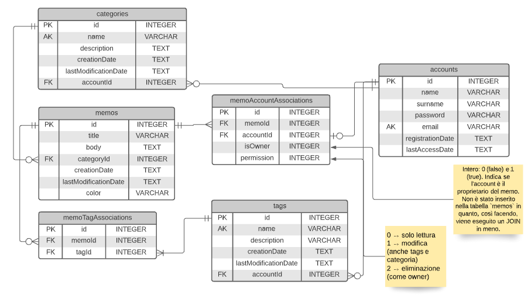
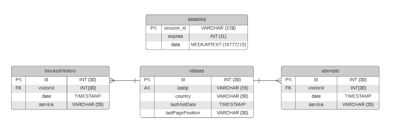
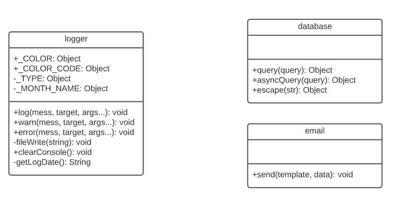
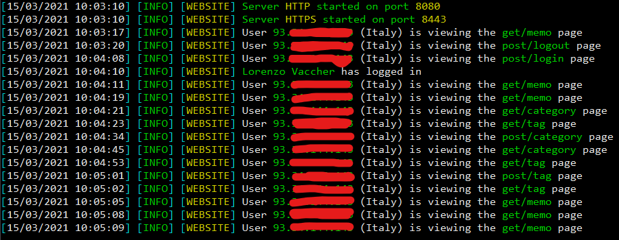
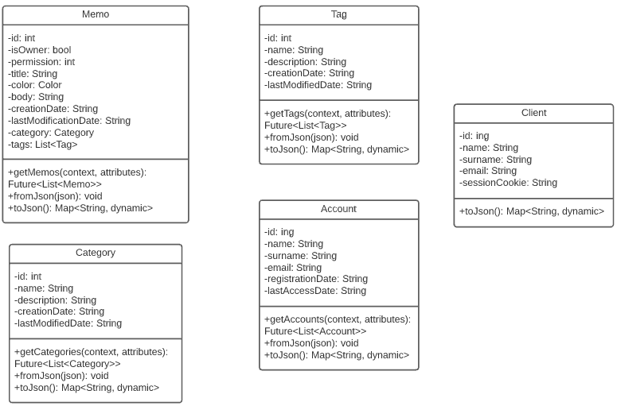

# APP Memo
Progetto che verte sulla realizzazione di una infrastruttura Client-Server che permetta la gestione (attraverso le operazioni CRUD) di alcuni memo con le relative categorie e i relativi tags. Come richiesto dalla consegna dell'esercizio sono state realizzare diverse features sia grafiche che tecniche, come per esempio il salvataggio di tutti in un server MySQL con una password criptata associata, la possibilità di modificare i colori di ogni songolo memo e così via.

Parte fondamentale del progetto è sicuramente la sicurezza. A tale scopo è stato impiegato il protocollo `HTTPS`, per permettere una trasmissione dei dati in modo sicuro e crittografati e un sistema di autenticazione con salvataggio dei tentativi di accesso per evitare eventuali `attacchi BruteForce`. Tale sistema infatti, dopo una serie di tentativi prestabiliti non andati a buon fine, blocca l'utente per un determinato lasso di tempo, diminuendo la possibilità di indovinare la password di un utente.

Grazie all'utilizzo di un `server VPS` con sistema operativo `Ubuntu 20.04`, è stato possibile far connettere più Clients senza l'utilizzo della rete locale. L'indirizzo ip del server è il seguente: `144.91.88.65:25501`.

## Struttura del progetto
Di seguito è illustrata, attraverso un diagramma ad albero, la struttura del progetto. 

```php
+-- client          //Client in Flutter
|
+-- server          //Server in NodeJs
|
+-- database.sql    //Database
```
## Database
Per il salvataggio di tutti i memo, di tutte le categorie, di tutti i tags e di tutti gli utenti è stato utilizzato un database relazionale (MySQL) strutturato nel seguente modo:
<div align="center">
  
</div>

Per offrire una maggior sicurezza agli utenti registrati al sito è stato utilizzato un sistema per la criptazione delle password basato sull'algoritmo `bcrypt` con 12 salti. Inoltre, come precedentemente descritto, è stato realizzato un sistema per la protezione di eventuali attacchi BruteForce. Questo sistema impiega le tabelle `visitors`, `attempts` e `blockedVisitors` per salvare tutti i tentativi di accesso da parte dei visitatori (tabella `attempts`) e i visitatori bloccati per un determinato servizio che può essere, per esempio, il login o la registrazione (tabella `blockedVisitors`).
<div align="center">
  
</div>

## Server
Il server che gestisce tutte le connessioni degli utenti è stato scritto in NodeJs, in contemporanea ai seguenti moduli:

- `mysql` → Modulo che gestisce la connessione con il database (Driver)
- `nodemon` → Modulo utilizzato durante la fase di sviluppo, per riavviare in modo automatico il server quando un file viene salvato
- `bcrypt` → Modulo per la criptazione delle password.
- `ejs` → Modulo per la renderizzazione delle pagine web.
- `http` → Modulo per la gestione delle richieste HTTP (post, get, put, delete, ...).
- `express` → Modulo per la gestione delle routes.
  
Oltre ai moduli appena citati sono stati creati dei moduli personalizzati per la gestione di funzioni particolari, come ad esempio l'invio di dati specifici o degli eventi inviati tramite Socket oppure per la gestione del database (database.js) e della console del server (logger.js).
### UML
Grafico UML della struttura del server:
<div align="center">
  
</div>

### Console
Per una miglior gestione del progetto e per il debug è stato realizzato un sistema di LOG che permette di salvare tutti gli eventi invocati mediante il modulo personalizzato `logger`. Tutte le azioni degli utenti, errori e avvisi, quindi, vengono salvati nella cartella LOG del progetto.
Qui di seguito è riportata l'immagini visiva della chat del server.
<div align="center">
  
</div>

### Struttura del server
``` php
+-- log/                  //Cartella che contiene tutti i LOG del server
|
+-- routes/              //Moduli del progetto
|     +-- api/
|     |     +-- delete.js
|     |     |
|     |     +-- get.js
|     |     |
|     |     +-- post.js
|     |     |
|     |     +-- put.js
|     |     |
|     |     +-- update.js
|     |     
|     +-- get.js      //Modulo per la gestione del database
|     |
|     \-- post.js       //Modulo per la gestione della console del server
|
+-- app.js                //File principale del progetto
|
+-- package.json          //File per le importazioni e i settings principali del progetto
|
\-- settings.json         //Impostazioni del database, del server ecc.

```

## Client
Il client è stato realizzato in Flutter (Dart) prendendo spunto da diverse immagini presenti in internet.
Per quanto riguada la connession client-server questa, è stata effettuata mediante la libreria `http` di dart, che permette, per appunto, di realizzare delle richieste HTTP a un determinato server, che in questo caso è: `https://lorenzovaccher.com:8443/`

### UML
<div align="center">
  
</div>

### Struttura del client
``` php
+-- android/
|
+-- assets/               //Immagini del progetto
|     \-- img
|
+-- build/
|
+-- ios/
|
+-- lib/
|    +-- utils/
|    |    +-- models/
|    |    |   +-- category.dart
|    |    |   |
|    |    |   +-- memo.dart
|    |    |   |
|    |    |   \-- tag.dart
|    |    \-- client.dart
|    +-- pages/
|    |    +-- authenticate/
|    |    |   +-- widget/
|    |    |   |   |
|    |    |   |   +-- login.dart
|    |    |   |   |
|    |    |   |   \-- register.dart
|    |    |   \-- authenticate.dart
|    |    |
|    |    +-- home/
|    |    |    +-- views/
|    |    |    |    +-- category.dart
|    |    |    |    |
|    |    |    |    +-- memo.dart
|    |    |    |    |
|    |    |    |    \-- tag.dart
|    |    |    |
|    |    |    +-- widget/
|    |    |    |    +-- actionButton.dart
|    |    |    |    |
|    |    |    |    +-- appBar.dart
|    |    |    |    |
|    |    |    |    \-- menu.dart
|    |    |    |
|    |    |    +-- category.dart
|    |    |    |
|    |    |    +-- memos.dart
|    |    |    |
|    |    |    \-- tags.dart
|    |    |
|    +-- widget/
|    |    \-- alert.dart
|    |
|    \-- main.dart
|
+-- test/                //Cartella di test
|
+-- app_memo.iml
|
\-- pubspec.yaml
```

### Immagini