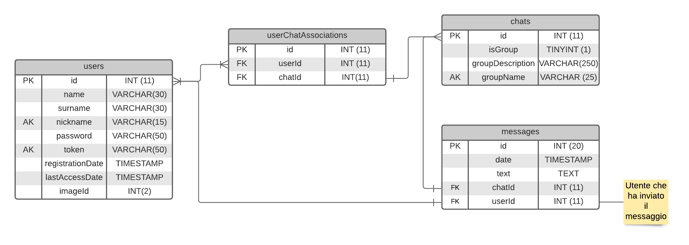
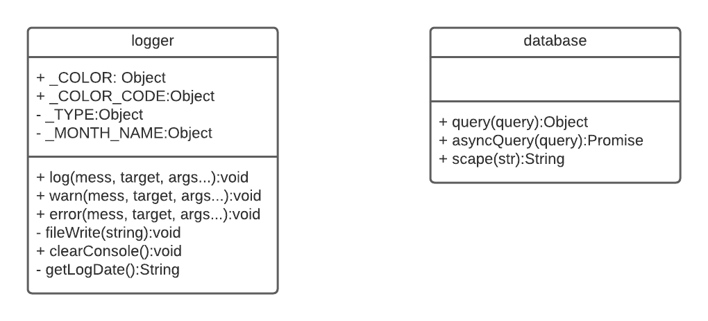
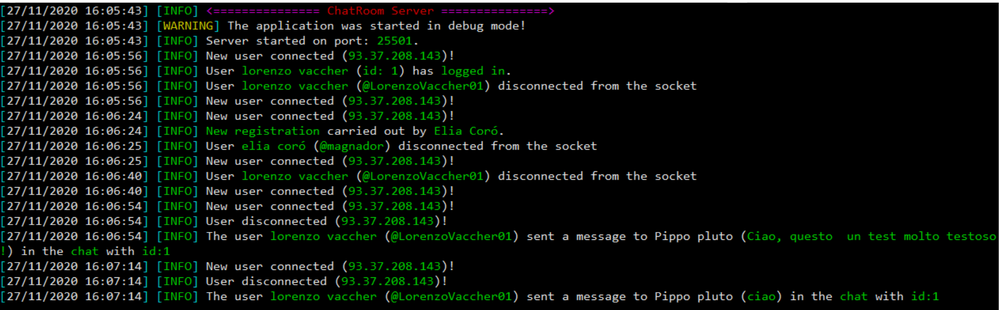
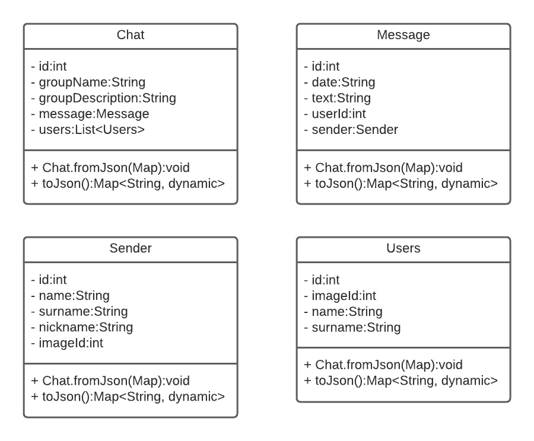

# ChatRoom

Progetto che verte sulla realizzazione di una infrastruttura Client-Server che permetta l'invio di dati tramite Socket (TCP). Come richiesto dalla consegna dell'esercizio sono state realizzare diverse features sia grafiche che tecniche, come per esempio il salvataggio di tutti gli utenti, dei messaggi e delle chat nel database, la possibilità di cambiare avatar.

Dato l'utilizzo dei `Socket` nel progetto è fondamentale dare una **definizione** a tale classe. Un socket è un oggetto software che permette l'invio e la ricezione di dati, tra host remoti (tramite una rete) o tra processi locali (Inter-Process Communication). Socket locali e remoti in comunicazione formano una coppia (pair), composta da indirizzo e porta di client e server; tra di loro c'è una connessione logica.Possiamo vedere i socket come degli intermediari tra il livello applicazione e di trasporto nello stack TCP/IP. Infatti la funzione dei socket è quella di indirizzamento dei processi.

Grazie all'utilizzo di un `server VPS` con sistema operativo `Ubuntu 20.04`, è stato possibile far connettere più Clients senza l'utilizzo della rete locale. L'indirizzo ip del server è il seguente: `144.91.88.65:25501`


## Struttura del progetto
Di seguito è illustrata, attraverso un diagramma ad albero, la struttura del progetto. 

``` php
+-- client          //Clinet in Flutter
|
+-- server          //Server in Dart
|
+-- database.sql    //Struttura del database
```

## Database
Per il salvataggio di tutti i messaggi, di tutti gli utenti e di tutte le chats è stato utilizzato un database relazionale (MySQL) strutturato nel seguente modo:
<div align="center">
  
</div>

### Query particolari
#### Query utilizzata per ottenere tutte le chats di un utente dato, appunto, l'id identificativo (`userId`) dell'utente in questione.

``` SQL
SELECT chats.isGroup, chats.groupDescription, chats.groupName, recipients.userId, recipients.chatId, recipients.name AS userName, recipients.surname AS userSurname, recipients.nickname AS userNickname, recipients.lastAccessDate AS userLastAccessDate, recipients.imageId AS userImageId 
FROM users 

INNER JOIN userChatAssociations ON users.id = userChatAssociations.userId 
INNER JOIN chats ON userChatAssociations.chatId = chats.id 
INNER JOIN (SELECT userChatAssociations.userId userChatAssociations.chatId, users.name, users.surname, users.nickname, users.lastAccessDate, users.imageId FROM  userChatAssociations) 
INNER JOIN (SELECT userChatAssociations.chatId FROM userChatAssociations 
WHERE userChatAssociations.userId = {n}) chatConUno ON chatConUno.chatId = userChatAssociations.chatId 
INNER JOIN users ON userChatAssociations.userId = users.id WHERE userChatAssociations.userId != {n}) recipients ON recipients.chatId = userChatAssociations.chatId 
WHERE users.id = {n};
```

Query utilizzata per la selezione di messaggi di una determinata chat:
``` SQL
SELECT id, text, date, userId FROM messages WHERE chatId={n} ORDER BY date DESC
```

## Server
Il server che gestisce tutte le connessioni degli utenti è stato scritto in **NodeJs**, in contemporanea ai seguenti **moduli**: 
- `net`→ Utilizzato per la gestione della connessione 
- `mysql` → Modulo che gestisce la connessione con il database (Driver)
- `nodemon` → Modulo utilizzato durante la fase di sviluppo, per riavviare in modo automatico il server quando un file viene salvato
- `bcrypt` → Modulo per la criptazione delle password.

Oltre ai moduli appena citati sono stati creati dei **moduli personalizzati** per la gestione di funzioni particolari, come ad esempio l'invio di dati specifici o degli eventi inviati tramite Socket oppure per la gestione del database (`database.js`), della console del server (`logger.js`), dell'autenticazione dei client (`auth.js`), ecc. 

### UML
<div align="center">
  
</div>

### Console
Per una miglior gestione del progetto e per il debug è stato realizzato un sistema di LOG che permette di salvare tutti gli eventi invocati mediante il modulo personalizzato `logger`. Tutte le azioni degli utenti, errori e avvisi, quindi, vengono salvati nella cartella LOG del progetto.
Qui di seguito è riportata l'immagini visiva della chat del server.
<div align="center">
  
</div>

### Pezzi di codice significativi
Di seguito è riportato lo switch che viene utilizzato per la gestione di tutti gli eventi; infatti, grazie a questo è possibile assegnare ogni evento ad un modulo.
``` JavaScript
socket.on('data', async (data) => {
  data = JSON.parse(data);

  // Switch utilizzato per la suddivisione di eventi in diversi file,
  // tali eventi spesso mantengono una connessione costante con il client
  // poichè quest'ultimo necessita di aggiornamenti costanti (nuovi messaggi
  // da parte di altri utenti ecc ecc).
  switch (data.event) {
    case 'end':
      _CONNECTIONS.delete(socket);
    break;
    case 'login': require('./modules/socket/events/login')(socket, data.data); break;
    case 'registration': require('./modules/socket/events/registration')(socket, data.data); break;
    case 'chats': require('./modules/socket/data/chats').get(socket, data.client); break;
    case 'chat': require('./modules/socket/data/chat').get(socket, data.client, data.chatId, data.peerId); break;
    case 'contacts': require('./modules/socket/data/contacts')(socket, data.client); break;
    case 'deleteAccount': require('./modules/socket/events/deleteAccount')(socket, data.client); break;
    case 'updateAvatar': require('./modules/socket/events/updateAvatar')(socket, data.client, data.imageId); break;
    case 'message':
      [...]
    break;
  }
});
```
### Struttura del server
``` php
+-- log/                  //Cartella che contiene tutti i LOG del server
|
+-- modules/              //Moduli del progetto
|     +-- socket/
|     |     +-- data/     //Dati da inviare tramite socket
|     |     |
|     |     +-- events/   //Eventi ricevuti tramite socket
|     |     |
|     |     +-- auth.js   //Modulo che gestisce l'autenticazione dei clients
|     |
|     +-- database.js      //Modulo per la gestione del database
|     |
|     \-- logger.js       //Modulo per la gestione della console del server
|
+-- app.js                //File principale del progetto
|
+-- package.json          //File per le importazioni e i settings principali del progetto
|
\-- settings.json         //Impostazioni del database, del server ecc.

```

## Client
todo: breve descrizione

### UML
<div align="center">
  
</div>