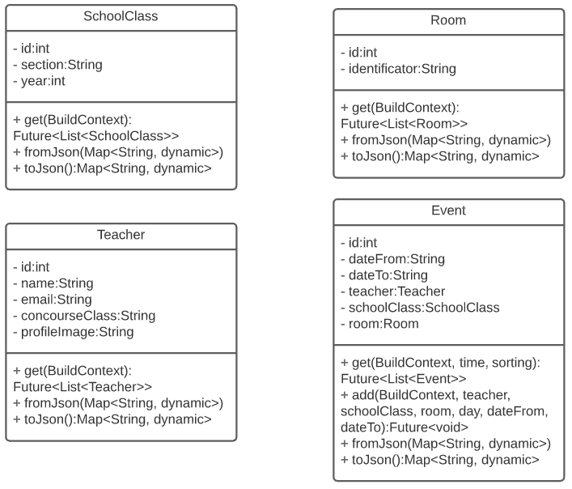

# Room reservations
<div align="center">
  
</div>

Progetto che verte sulla realizzazione di una infrastruttura Client-Server che permetta la gestione (attraverso le operazioni CRUD) delle pronotazioni di alcune aule da parte dei docenti della scuola.
Come richiesto dalla consegna dell'esercizio sono state realizzare diverse features sia grafiche che tecniche, come per esempio il salvataggio di tutti in un server MySQL con una password criptata associata, la possibilità di aggiungere degli eventi ad altri professori sse si è amministratori e così via.

Parte fondamentale del progetto è sicuramente la sicurezza. A tale scopo è stato impiegato il protocollo `HTTPS`, per permettere una trasmissione dei dati in modo sicuro e crittografati e un sistema di autenticazione con salvataggio dei tentativi di accesso per evitare eventuali `attacchi BruteForce`. Tale sistema infatti, dopo una serie di tentativi prestabiliti non andati a buon fine, blocca l'utente per un determinato lasso di tempo, diminuendo la possibilità di indovinare la password di un utente.

Grazie all'utilizzo di un `server VPS` con sistema operativo `Ubuntu 20.04`, è stato possibile far connettere più Clients senza l'utilizzo della rete locale. L'indirizzo ip del server è il seguente: `144.91.88.65:25501`.

## Struttura del progetto
Di seguito è illustrata, attraverso un diagramma ad albero, la struttura del progetto. 

```php
+-- client          //Client in Flutter
|
+-- server          //Server in NodeJs
|
+-- database.sql    //Database
```

## Database
### Server (MySQL)
Per il salvataggio di tutti i memo, di tutte le categorie, di tutti i tags e di tutti gli utenti è stato utilizzato un database relazionale (MySQL) strutturato nel seguente modo:
<div align="center">
  
</div>

Per offrire una maggior sicurezza agli utenti registrati al sito è stato utilizzato il sistema fornito da Firebase (Google).

#### Query particolari
**Registrazione di un utente:**
``` SQL
INSERT INTO teachers(name, email, uid, fcmToken) VALUES(${decodedToken.name}, ${decodedToken.email}, ${decodedToken.uid}, ${fcmToken})
```

**Selezione di tutti gli eventi:**
```SQL
SELECT reservations.id, reservations.dateFrom, reservations.dateTo, reservations.creationDate, rooms.id AS roomId, rooms.identifier AS roomIdentifier, teachers.id AS teacherId, teachers.name, teachers.email, classes.id as classId, classes.section, classes.year
FROM reservations
INNER JOIN rooms ON rooms.id = reservations.roomId
INNER JOIN teachers ON teachers.id = reservations.teacherId
INNER JOIN classes ON classes.id = reservations.classId
WHERE reservations.dateFrom LIKE "${date} %" ${sorting}
```
## Client
Il client è stato realizzato in Flutter (Dart) prendendo spunto da diverse immagini presenti in internet.
Per quanto riguada la connession client-server questa, è stata effettuata mediante la libreria `http` di dart, che permette, per appunto, di realizzare delle richieste HTTP a un determinato server, che in questo caso è: `https://lorenzovaccher.com:8443/`

### Schema UML dei modelli
<div align="center">
  
</div>

Per semplicità, nello schema qui sopra riportato non sono stati indicati i metodi getter e setter.

Struttura analoga, hanno i modelli utilizzati per la gestione e creazione del database gestito con Floor. L'unica osservazione da fare su quest'ultimi è che non presentano oggetti come `Category` o `Tag` in quanto il database non è predisposto per salvare questa tipologia di dati.

### Grafico UML degli eventi:
<div align="center">
  
</div>

### Floor
Floor fornisce una chiara astrazione SQLite le applicazioni Flutter ispirata alla libreria di persistenza Room. Viene fornito con la mappatura automatica tra gli oggetti in memoria e le righe del database, pur offrendo il pieno controllo del database con l'uso di SQL. Di conseguenza, è necessario avere una comprensione di SQL e SQLite per sfruttare appieno il potenziale di Floor.

La struttura di tale database è simile a quella di MySQL, tranne per il fatto che non sono presenti le password nella tabella utenti, la tabella sessioni, utenti bloccati, visitatori e tentativi.

## Server
Il server che gestisce tutte le connessioni degli utenti è stato scritto in NodeJs, in contemporanea ai seguenti moduli:

- `mysql` → Modulo che gestisce la connessione con il database (Driver)
- `nodemon` → Modulo utilizzato durante la fase di sviluppo, per riavviare in modo automatico il server quando un file viene salvato
- `bcrypt` → Modulo per la criptazione delle password.
- `ejs` → Modulo per la renderizzazione delle pagine web.
- `http` → Modulo per la gestione delle richieste HTTP (post, get, put, delete, ...).
- `express` → Modulo per la gestione delle routes.
  
Oltre ai moduli appena citati sono stati creati dei moduli personalizzati per la gestione di funzioni particolari, come ad esempio l'invio di dati specifici o degli eventi inviati tramite Socket oppure per la gestione del database (database.js) e della console del server (logger.js).
### UML
#### Grafico UML delle classi del server:
<div align="center">
  
</div>

### Moduli personalizzati
#### Logger
Modulo utilizzato per la gestione della console del server. Tale modulo, infatti, permette di scrivere delle informazioni nella console e allo stesso tempo di salvarle in una cartella (`/log`) organizzata per anno e per mese dove vi sono tutte le azioni che gli utenti hanno eseguito in un determinato periodo di tempo, indicando data e ora.

Una delle **parti più significative** di tale modulo è la seguente:
``` JavaScript
let log = (string, target, args = []) => {
  if (target != undefined || target != null)
    if (_TARGET[target.toLocaleLowerCase()] != undefined)
      string = _TARGET[target.toLocaleLowerCase()] + string;
    else
      error('The target is not defined for the following message!');

  for (let i = 0; i < Object.keys(args).length; i++)
    string = string.split('%' + Object.keys(args)[i] + '%').join(Object.values(args)[i]);

  for (let i = 0; i < Object.values(_COLOR_CODE).length; i++)
    string = string.split(Object.values(_COLOR_CODE)[i]).join(Object.values(_COLOR)[i]);

  console.log(getConsoleDate() + _TYPE.INFO + string + _COLOR.RESET);

  for (let i = 0; i < Object.values(_COLOR).length; i++)
    string = string.split(Object.values(_COLOR)[i]).join('');

  fileWrite('[INFO] ' + string);
}
```
#### Email
Tale progetto prevede anche l'invio di Email agli utenti a cui è stato condiviso un Memo.
Per l'invio dell'email è stato utilizzato un account Email Pro fornito da OVH (`info@lorenzovaccher.com`) e la seguente funzione:
``` JavaScript
exports.send = function (data) {
  let transporter = nodemailer.createTransport({
    host: settings.email.host,
    port: settings.email.port,
    secure: settings.email.secure,
    pool: settings.email.pool,
    auth: {
      user: settings.email.auth.user,
      pass: settings.email.auth.password
    }
  });

  for (var i = 0; i < data.to.length; i++) {
    transporter.sendMail({
      from: settings.email.from,
      to: data.to[i].email,
      subject: data.subject,
      attachments: data.attachments,
      html: data.data.html
    }, function (error, info) {
      if (error) {
        logger.error(error, "email");
      } else {
        logger.log(`Email sent &aTO&r: &a${info.envelope.to}&r. &aEmail ID&r: &a${info.messageId}&r.`, "email");
      }
    });
  }
};
```

#### Database
Come per quanto riguarda l'invio di email e la gestione della console, anche per la gestione del database è presente un mdoulo, che fornisce due funzioni:
- Una per l'esecuzione di Query in modo Asincrono
- Ed un'altra per l'esecusione di Query in modo Sincrono (Gestite tramite delle Promise)

#### Console
Per una miglior gestione del progetto e per il debug è stato realizzato un sistema di LOG che permette di salvare tutti gli eventi invocati mediante il modulo personalizzato `logger`. Tutte le azioni degli utenti, errori e avvisi, quindi, vengono salvati nella cartella LOG del progetto.
Qui di seguito è riportata l'immagini visiva della chat del server.
<div align="center">
  
</div>

#### Struttura del server
``` php
+-- log/                  //Cartella che contiene tutti i LOG del server
|
+-- routes/              //Moduli del progetto
|     +-- api/
|     |     +-- delete.js
|     |     |
|     |     +-- get.js
|     |     |
|     |     +-- post.js
|     |     |
|     |     +-- put.js
|     |     |
|     |     +-- update.js
|     |     
|     +-- get.js      //Modulo per la gestione del database
|     |
|     \-- post.js       //Modulo per la gestione della console del server
|
+-- app.js                //File principale del progetto
|
+-- package.json          //File per le importazioni e i settings principali del progetto
|
\-- settings.json         //Impostazioni del database, del server ecc.

```
