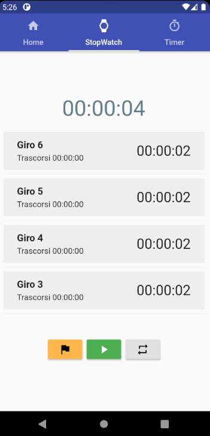
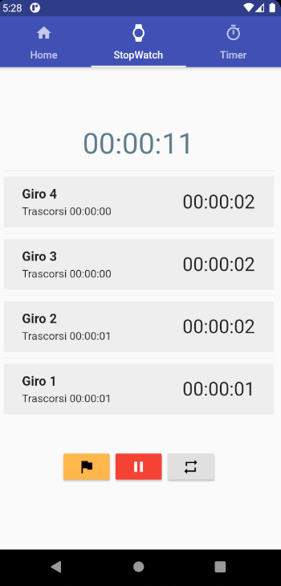

# Cronometro & Timer
Questo esercizio verte sulla realizzazione di un Timer e un Cronometro mediante l'utilizzo di uno **Stream** per la gestione dei Tick (segnali di tempo prestabiliti) in **Flutter** (Dart). Come richiesto dalla consegna dell'esercizio sono state realizzare **diverse features** sia grafiche che tecniche, come per esempio i Lap, ovvero i tempi parziali (per il StopWatch) che l'utente può tracciare, oppure la selezione del tempo per il Timer mediante dei bottoni (`+` e `-`).

Dato l'utilizzo degli `Stream` nel progetto è fondamentale dare una **definizione** a tale classe. Uno **stream**, che tradotto significa flusso, è un metodo per fornire sequenze di dati in modo asincrono tramite degli eventi invocati. Ogni evento è un evento di dati, chiamato anche elemento dello stream, o un errore, che è una notifica che qualcosa non è riuscito. Tale flusso può essere ascoltato mediante il metodo `listen()` che ritorna un oggetto `StreamSubscription` che è l'oggetto attivo che fornisce gli eventi e che può essere utilizzato per interrompere nuovamente l'ascolto o per sospendere temporaneamente gli eventi. Esistono due tipo di Stream: "Single-subscription" e "Broadcast". Nel primo caso, metodo utilizzato nel progetto in questione, uno Stream può fornire i dati a un solo ascoltatore, mentre, nel secondo caso, lo Stream fornisce dati a un numero qualsiasi di ascoltatori.

## Struttura del progetto
```
+---ios
|
+---android
|
+---build
|
+---ios
|
+---lib                     //Cartella principale del progetto
|   |   main.dart           //File principale, eseguibile.
|   |
|   +---utils               //Utilità e classi
|   |       clock.dart      //Classe per la gestione dell'orologio (estende ticker)
|   |       laps.dart       //Classe per la gestione dei giri (laps)
|   |       ticker.dart     //Classe per la gestione dei tick
|   |
|   \---views               //Visualizzazioni della pagina
|           stopwatch.dart  //Visualizzazione della sezione stopwatch
|           timer.dart      //Visualizzazione della sezione timer
|           home.dart       //Visualizzazione della pagina principale
|
\---test                    //Cartella di test
        widget_test.dart
```

Come illustrato nel diagramma ad albero qui sopra mostrato, il progetto, contenuto nalla cartella principale (`lib`), è stato suddiviso nei seguenti **files**:
- `main` → File contenente la Classe principale del progetto. Tale classe viene eseguita per avviare l'applicazione.
- `clock` → File contenente la Classe che gestisce le ore, i secondi, i minuti e le funzioni per avviare, stoppare e resettare l'orario. Tale classe estende la classe `Ticker`. 
- `laps` → File suddiviso nelle seguenti classi:
  - `Laps` → Struttura dati che estende `ListBase` per la realizzazione di una lista di `Lap` (`Laps<Lap>`). Questa classe 
  - `Lap` → Struttura dati (Classe) per il salvataggio dei dati relativi a un Lap (giro del cronometro).
- `ticker` → Classe che gestisce i Tick dato un tempo prestabilito (`Duration`), esempio: 1 secondo. Tale classe viene estesa da `Clock` in quanto utilizzata per gestire il tempo come se fosse un metronomo.
- `stopwatch` → Widget della pagina dedicata allo `StopWatch`.
- `timer` → Wiget della pagina dedicata al `Timer`.
- `home` → Widget della pagina principale del progetto. Essa mostra l'ora e la data attuale, informazioni ottenute grazie alla Classe `Date` e aggiornate ogni secondo grazie alla Classe `Clock`.

## Struttura delle classi
Qui di seguito è riportato il diagramma UML delle classi presenti nella cartella `utils`, classi utilizzate per la realizzazione di strutture dati personalizzate.
<div align="center">
  
</div>

**NB:** Per semplicità non sono stati riportati, nel diagramma UML mostrato, i metodi `getter` e `setter`.

### Clock
##### Attributi:
- `reverse` → Attributo utilizzato per deterrminare se la Classe `Clock` viene utilizzata dal Timer o dallo StopWatch.
##### Metodi:
- **start():** `Stream<int>` → Metodo utilizzato per avviare il Clock. Il tipo di ritorno è uno `Stream<int>` fornendo un metodo asincrono per inviare dati in modo continuo e costante.
- **stop(StreamSubscription streamSubscription):** `void` → Metodo che, dato uno `StreamSubscription` ovvero il valore ritornato dal metodo `listen()` di uno Stream, stoppa il conteggio del tempo.
- **reset():** `void` → Reset del tempo (porta a `0` i secondi, i minuti e le ore). Oltre a resettare il conteggio del tempo, questo metodo resetta, dove necessario, la lista Laps.
- **addSecond() :** `void` → In base a `reverse` questo metodo sottrae un secondo all'orario scelto (Timer) o ne aggiunge uno (StopWatch), tenendo in considerazione anche una eventuale somma o sottrazione di minuti/ore.
- **addLap(int hours, int minutes, int seconds):** `void` → Aggiunge un giro alla lista `Laps<Lap>`.
- **resetLaps():** `void` → Metodo utilizzato per resettare tutti i `Lap` presenti nella lista `Laps<lap>`.

### Ticker
##### Metodi:
- **start():** `Stream<int>` → Inizializza lo `Stream` mediante il metodo `timedCounter`.
- **timedCounter(Duration duration):** `Stream<int>` → Funzione privata della Classe `Ticker` che realizza gli impulsi in base all'intervallo passato come parametro. Di seguito è riportato il codice del metodo in questione.
``` dart
  Stream<int> timedCounter(Duration interval) async* {
    int i = 0;
    while (true) {
      await Future.delayed(interval); //metodo per bloccare l'esecuzione del programma per interval tempo.
      yield i++;
    }
  }
```

## Struttura delle views
Tutte le "Views" qui sotto descritte sono dei `Widget` utilizzati per realizzazione delle singole "pagine". Tutte le `Tab` ("pagine"), istanziate nella classe `Main`, sono contenute in una `TabBar` che a sua volta è coontenuta nella `AppBar` dell'applicazione. Ogni `Tab` è composta da una `Icon` e un `Text`.

Un metodo in comune che hanno tutte le Views, oltre al metodo `build`, è il seguente:

``` Dart
  @override
  void dispose() {
    if (_streamSubscription != null) _clock.pause(_streamSubscription);
    super.dispose();
  }
```
Tale metodo evita che il `Clock` continui a mandare impusi (Tick) alla/e Views quando queste vengono tolte dall'albero dei Widget, ovvero quando viene cambiata la Tab dall'utente. Tale metodo viene invocato, appunto, quando la View viene tolta dall'albero dei Widget.

### Home
`Home` è la View principale del progetto, quella che viene mostrata all'avvio dell'applicazione. In questa `Tab` viene mostrata l'ora e la data attuale. Per ottenere l'aggiornamento in tempo reale dalla data è stata utilizzata la classe `Date`, per ottenere l'ora e la data, e la classe `Clock`, per gestire gli impulsi, i secondi, i minuti e le ore.
##### Struttura
```
+--- Scaffold
|     \-- Center
|         +-- Column
|              +-- Container
|              |     \-- Text                                 //Orario {hh:mm:ss}
|              +-- Container
|              |    \-- Text                                  //"Ora standard dell'Europa centrale"
|              \-- Container
|                   \-- Text                                  //Data {GG dd MM}
```
##### Immagini
<div align="center">
  
</div>

### StopWatch
Il Widget `StopWatch` è la View, come dice il nome stesso della Classe, della `Tab` relativa al Cronometro. Di particolare in questa sezione è sicuramente la gestione dei `Laps`/`Laps`, descritti precedentemente, e la gestione dei bottoni (`RaisedButton`). Infatti, questi, vengono gestiti tramite il campo `status` della Classe `Clock` e tramite i Widget `Visibility`, che permettono di oscurare un elemento grafico in base ad un valore booleano passatogli come valore.
##### Struttura
```
+--- Scaffold
|     \-- Center
|         +-- Column
|              +-- Container
|              |     \-- Text                                 //Orario {hh:mm:ss}
|              +-- Visibility
|              |    \-- Container
|              |        \-- ListView.separated                //Widget per la grafica dei Laps
|              |             \-- Container
|              |                  \-- Container
|              |                      \-- Row
|              |                          \-- Column
|              |                              +-- Text        //Identificativo del lap
|              |                              +-- Container
|              |                              |   \-- Text    //hh:mm:ss trascorsi
|              |                              \-- Text        //Orario del Lap
|              \-- Container
|                   \-- ButtonBar                             //Contenitore dei bottoni
|                       +-- Visibility
|                       |    +-- RaisedButton                 //Bottono per i Lap
|                       |        +-- Icon
|                       +-- RaisedButton                      //Bottone "start" e "stop"
|                       \-- Visibility
|                           \-- RaisedButton                  //Bottone per il reset
|                               +-- Icon
```
##### Immagini
<div align="center">
  
  
  
  
</div>

### Timer
Come per quanto riguarda la View dello `StopWatch`, anche nella View del `Timer`, i bottoni vengono gestiti tramite il Widget `Visibility` e tramite un campo (`status`) della Classse `Clock`. Un aspetto paricolare di questa View sono i bottoni `+` e `-` che permettono all'utente di selezionare il tempo da cui far partire il Timer.
##### Struttura
```
+--- Scaffold
|     \-- Center
|        \-- Column
|            +-- Row
|            |   +-- Column
|            |   |   +-- Container
|            |   |   |   \-- Opacity
|            |   |   |       \-- RaisedButton                //Bottone addizione minuto
|            |   |   |           \-- Icon                    //Icona "+"
|            |   |   +-- Text                                //Testo ore
|            |   |   \-- Container
|            |   |       \-- Opacity
|            |   |           \-- RaisedButton                //Bottone sottrazione ora
|            |   |               \-- Icon                    //Icona "-"
|            |   +-- Text                                    //":"
|            |   +-- Column
|            |   |   +-- Container
|            |   |   |   \-- Opacity
|            |   |   |       \-- RaisedButton               //Bottone addizione minuto
|            |   |   |           \-- Icon                   //Icona "+"
|            |   |   +-- Text                               //Testo minuti
|            |   |   \-- Container
|            |   |       \-- Opacity
|            |   |           \-- RaisedButton               //Bottone sottrazione minuto
|            |   |               \-- Icon                   //Icona "-"
|            |   +-- Text                                   //":"
|            |   \-- Column
|            |       +-- Container
|            |       |   \-- Opacity
|            |       |       \-- RaisedButton               //Bottone addizione secondo
|            |       |           \-- Icon                   //Icona "+"
|            |       +-- Text                               //Testo secondi
|            |       \-- Container
|            |           \-- Opacity
|            |               \-- RaisedButton               //Bottone sottrazione secondo
|            |                   \-- Icon                   //Icona "-"
|            \-- Container
|                \-- ButtonBar
|                    +-- RaisedButton                       //Bottone per avviare e stoppare il timer
|                    |   \-- Container                      
|                    |       \-- Icon                       //Icona start e reset
|                    \-- Visibility
|                        \-- RaisedButton                   //Bottone reset
|                            \-- Container
|                                \-- Icon                   //Icona di reset
```

##### Immagini
<div align="center">
  
  
  
</div>